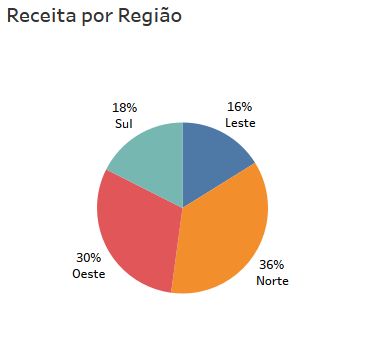

# Titulo do Projeto

Escrever descrição

## 1. Objetivos

## 2. Análise Exploratória dos Dados

#### 2.1 O Conjunto de dados

A figura abaixo mostra uma parte do conjunto de dados utilizado neste projeto. 

  

Descrição das colunas:
* **Representantes:** informa o nome dos representantes de vendas responsável por aquela venda. 
* **Produto:** informa o produto vendido 
* **Quantidade:** Unidades do produto vendido
* **Receita:** Valor em Rúpias Indianas (INR) obtidos na venda
* **Região:** Zona na qual ocorreu a venda

O conjunto de dados completo possui 10 mil linhas, onde temos 72 Representantes de Vendas (RVs), divididos em 4 regiões, para venderem 12 produtos distintos.

No gráfico abaixo podemos visualizar como estão distribuidos os RVs em cada região. As regiões Norte e Oeste são as que possuem mais representantes.

  

Também é importante identificarmos qual a contribuição de cada região para a receita total da empresa conforme mostra o gráfico abaixo.

  

Aqui é possível perceber que as regiões (Norte e Oeste) que possuem mais RVs são as que geram maior receita. Não necessariamente isso representa uma relação de causa e efeito, porém seria valida uma análise mais aprofundada para saber o impacto na receita de uma região com a variação do número de representantes que atuam nela. Para isso seria necessário que os dados disponíveis possuissem uma dimensão de tempo.

  

