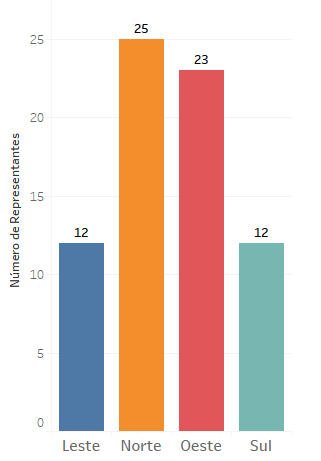

# Titulo do Projeto

Escrever descrição

## 1. Objetivos

## 2. Análise Exploratória dos Dados

#### 2.1 O Conjunto de dados

A figura abaixo mostra uma parte do conjunto de dados utilizado neste projeto. 

  

Descrição das colunas:
* **Representantes:** informa o nome dos representante de vendas responsável por aquela venda. 
* **Produto:** informa o produto vendido 
* **Quantidade:** Unidades do produto vendido
* **Receita:** Valor em Rúpias Indianas (INR) obtidos na venda
* **Região:** Zona na qual ocorreu a venda

O conjunto de dados completo possui 10 mil linhas, onde temos 72 Representantes de Vendas, dividos em 4 regiões, para venderem 12 produtos distintos.

  

